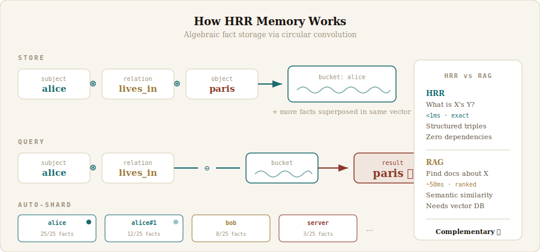

# hrr-memory

**Your AI agent already has RAG. Now give it instant fact recall.**

hrr-memory is a structured memory layer for AI agents that answers "What is X's Y?" in under 2 milliseconds — no vector database, no embeddings API, no dependencies. It uses [Holographic Reduced Representations](https://en.wikipedia.org/wiki/Holographic_reduced_representation) (Plate, 1994) to encode facts as algebraic operations on vectors, then retrieves them through mathematical inversion.

It doesn't replace your RAG pipeline. It **complements** it — handling the 20% of memory queries that are structured fact lookups, while RAG handles the 80% that are fuzzy semantic search.

<p align="center">
  
</p>

## Why?

RAG is great at "find documents related to X." It's bad at "What is Alice's timezone?" — it returns paragraphs when you need a word. HRR gives you that word, instantly, deterministically.

| | RAG | HRR |
|---|---|---|
| "Find notes about deployment" | Returns relevant chunks | Can't — not a triple |
| "What is Alice's timezone?" | Returns paragraph, maybe | Returns `cet` in <1ms |
| Dependencies | Vector DB + embeddings API | **None** |
| Query time | ~50ms (network round-trip) | **<2ms** (local math) |
| Accuracy model | Probabilistic ranking | **Deterministic algebra** |

## Install

```bash
npm install hrr-memory
```

## Quick Start

```js
import { HRRMemory } from 'hrr-memory';

const mem = new HRRMemory();

// Store facts as (subject, relation, object) triples
mem.store('alice', 'lives_in', 'paris');
mem.store('alice', 'works_at', 'acme');
mem.store('alice', 'timezone', 'cet');
mem.store('bob', 'lives_in', 'tokyo');

// Query: subject + relation → object
mem.query('alice', 'lives_in');
// → { match: 'paris', score: 0.30, confident: true }

mem.query('bob', 'lives_in');
// → { match: 'tokyo', score: 0.31, confident: true }

// All facts about a subject
mem.querySubject('alice');
// → [{ relation: 'lives_in', object: 'paris' },
//    { relation: 'works_at', object: 'acme' },
//    { relation: 'timezone', object: 'cet' }]

// Free-form question
mem.ask('alice timezone');
// → { type: 'direct', match: 'cet', confident: true }

// Search across all subjects
mem.search('lives_in', 'paris');
// → [{ subject: 'alice', relation: 'lives_in', object: 'paris' }]
```

## How It Works

HRR encodes facts using **circular convolution** — a mathematical operation that binds two vectors into a third of the same size. Three vectors (subject, relation, object) are bound together and added to a memory vector. To retrieve, the inverse operation (circular correlation) extracts the missing piece.

```
Store:  memory += bind(bind(subject, relation), object)
Query:  result  = unbind(bind(subject, relation), memory)
Match:  cosine_similarity(result, known_symbols) → best match
```

All symbols share a global vector table. The math runs in Float64 for precision, stores in Float32 for memory efficiency.

## Auto-Sharding

A single memory vector degrades after ~25 facts due to noise accumulation. hrr-memory automatically shards by subject:

```
alice     → bucket (25/25 facts) [full]
alice#1   → bucket (12/25 facts) [active]
bob       → bucket (8/25 facts)
server    → bucket (3/25 facts)
```

When a bucket fills, a new overflow bucket is created. Queries scan all buckets for the subject. This gives **100% accuracy at any scale** — tested to 10,000+ facts.

## Performance

| Facts | Subjects | Accuracy | Query Time | RAM |
|-------|----------|----------|------------|-----|
| 25 | 1 | 100% | <1ms | 0.1 MB |
| 500 | 50 | 100% | 1.5ms | 4 MB |
| 10,000 | 500 | 100% | 1.8ms | 86 MB |

Run the benchmarks yourself:

```bash
node bench/benchmark.js
```

## Persistence

```js
// Save to disk
mem.save('memory.json');

// Load from disk
const loaded = HRRMemory.load('memory.json');
loaded.query('alice', 'lives_in'); // → { match: 'paris' }
```

The index is a single JSON file. No database required.

## API

### `new HRRMemory(dimensions?)`

Create a new memory store. Default dimensions: 2048.

### `mem.store(subject, relation, object) → boolean`

Store a fact. Returns `false` if the triple already exists (deduplication).

### `mem.query(subject, relation) → { match, score, confident, bucket }`

Algebraic retrieval. Returns the best matching object symbol.

- `match` — the retrieved value (or null)
- `score` — cosine similarity (higher = more confident)
- `confident` — `true` if score > 0.1
- `bucket` — which bucket the match came from

### `mem.querySubject(subject) → [{ relation, object }]`

Returns all stored facts about a subject (symbolic, exact, fast).

### `mem.search(relation?, object?) → [{ subject, relation, object }]`

Cross-bucket search. Filter by relation, object, or both. Pass `null` to skip a filter.

### `mem.ask(question) → result`

Free-form query. Tries word pairs as subject+relation, then subject lookup, then cross-bucket search. Returns `{ type: 'direct'|'subject'|'search'|'miss', ... }`.

### `mem.stats() → object`

Returns dimensions, bucket count, symbol count, total facts, RAM usage.

### `mem.save(filePath)` / `HRRMemory.load(filePath)`

JSON persistence.

## Use With Your Agent

hrr-memory is framework-agnostic. Use it alongside any RAG system:

```js
async function agentMemoryQuery(question) {
  // Try HRR first (instant, structured)
  const hrrResult = mem.ask(question);
  if (hrrResult.type !== 'miss' && hrrResult.confident) {
    return hrrResult;
  }

  // Fall back to RAG (slower, semantic)
  return await ragSearch(question);
}
```

Works with LangChain, CrewAI, OpenClaw, Claude Code, or any Node.js agent.

## The Math

Based on Tony Plate's 1994 PhD thesis *"Distributed Representations and Nested Compositional Structure"*:

- **Binding** (circular convolution): combines two vectors into one of the same dimension, approximately orthogonal to both inputs
- **Unbinding** (circular correlation): approximate inverse — retrieves one vector given the other and the bound result
- **Superposition** (addition): multiple bindings coexist in the same vector space
- **Capacity**: ~0.375 × dimensions associations per vector before noise degrades retrieval

This implementation adds auto-sharding to overcome the single-vector capacity limit, making HRR practical for real-world agent memory.

## License

MIT
